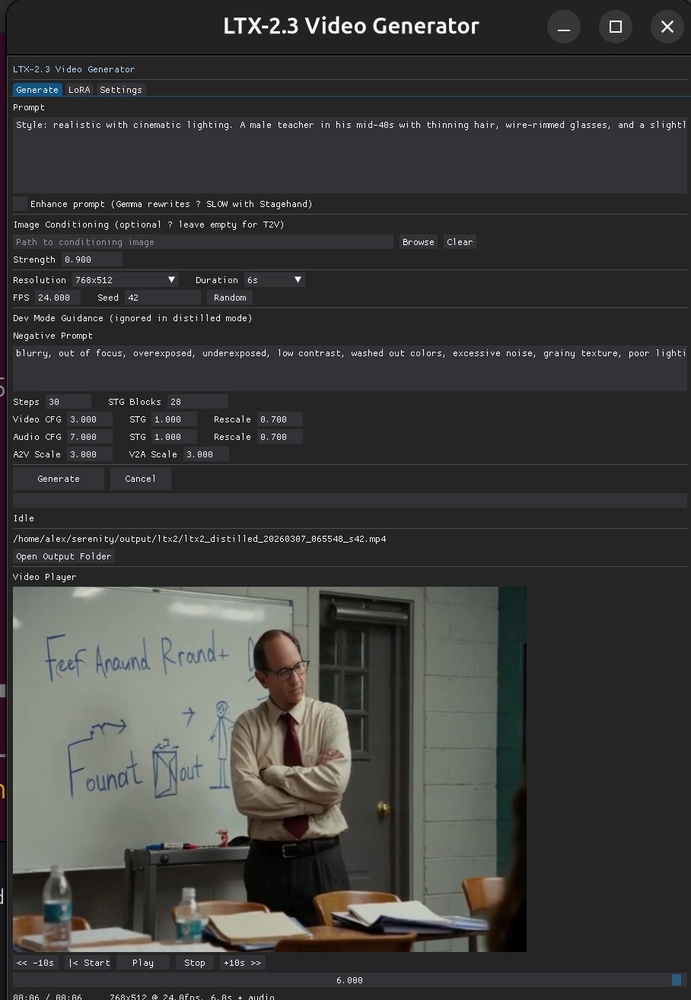

# LTX-2 Desktop with StageHand

Standalone desktop application for LTX-2.3 22B video generation on a **single 24GB GPU** — no 32GB+ VRAM required. Uses [StageHand](https://github.com/CodeAlexx/StageHand) to stream the 22B transformer through VRAM one block at a time.



## Current Status

- **Use Version 1 defaults for all settings.** Recent changes broke some advanced features and only the v1 defaults are working right now.
- **LoRA is untested** — the UI supports loading LoRAs but this has not been validated. No guarantees.
- **Gemma 3 12B** — The full (unquantized) Gemma 3 12B model is required. Quantized variants (INT8, QAT, GGUF) from other projects are not compatible with how ltx_core loads the text encoder. StageHand streams Gemma3 layers through VRAM one at a time (~512MB per layer), so the VRAM cost is low — the main cost is system RAM during loading.

## Key Points

- **Runs on 24GB VRAM** — Tested on RTX 3090 Ti. The official LTX-2.3 22B pipeline requires 32GB+. StageHand block-swapping brings it down to 24GB by streaming transformer blocks through a pinned memory pool.
- **Linux only** — Not tested on Windows or macOS. May work but no guarantees.
- **Lower VRAM cards** — Unknown. 24GB is the minimum tested. Cards with less VRAM may OOM.

## Features

- **Two-stage distilled pipeline** — 8+3 denoising steps with spatial upscaler
- **Four-pass pipeline** — Full-res base → spatial upscale → temporal upscale → refinement
- **Dev mode** — Full CFG/STG guidance with configurable steps, negative prompts, and distilled LoRA for stage 2
- **NAG (Normalized Attention Guidance)** — Dual-pass attention guidance for improved coherence without CFG overhead. Configurable scale, alpha, tau.
- **Text-to-Video & Image-to-Video** — First-frame conditioning with adjustable strength
- **Audio generation** — Ambient audio generated alongside video, decoded via vocoder
- **Long video** — Temporal tiling with overlap blending and AdaIN normalization for multi-minute output. Presets for quality/speed tradeoff.
- **Spatial tiling** — Tile-based stage 2 denoising for higher resolutions with linear blend ramps
- **FFN chunking** — Chunk feed-forward activations to reduce peak VRAM by 50-75% on long sequences
- **Prompt enhancement** — Optional Gemma 3 12B prompt rewriting (slow with StageHand)
- **LoRA support** — Load custom LoRAs with per-adapter strength control
- **DearPyGui interface** — Inline video player with audio, progress tracking, file browser

## Requirements

- NVIDIA GPU with 24GB+ VRAM (tested on RTX 3090 Ti)
- Linux (not tested on Windows/macOS)
- Python 3.10+
- ~62GB system RAM recommended
- [ltx-core](https://github.com/Lightricks/LTX-Video) and ltx-pipelines packages
- [StageHand](https://github.com/CodeAlexx/StageHand) for block-swapping

### Model Files

- LTX-2.3 22B distilled checkpoint (`.safetensors`)
- Gemma 3 12B text encoder
- Spatial upsampler
- (Optional) LTX-2.3 dev checkpoint + distilled LoRA for dev mode

## Installation

```bash
pip install -r requirements.txt
```

> **Note:** StageHand is installed from GitHub automatically via `requirements.txt`. Do **not** run `pip install stagehand` — that installs an unrelated PyPI package with the same name.

Ensure `ltx-core/src` and `ltx-pipelines/src` are on your Python path. Either place the `LTX-2/packages` directory inside the app folder, or set `LTX_PACKAGES` to its location:

```bash
export LTX_PACKAGES=/path/to/LTX-2/packages
```

## Usage

```bash
python main.py
```

Configure model paths in the **Settings** tab, then use the **Generate** tab to create videos.

### Pipeline Modes

| Mode | Stage 1 | Stage 2 | Steps | Quality |
|------|---------|---------|-------|---------|
| **Distilled** | Half-res, simple denoise | Full-res, simple denoise | 8+3 | Good, fast |
| **Dev** | Half-res, CFG/STG guidance | Full-res, distilled LoRA | N+3 | Higher, slower |
| **Four-pass** | Full-res denoise | Spatial 2x → Temporal 2x → Refine | 8+8 | Highest, slowest |

### Performance (RTX 3090 Ti, 768x512, distilled mode)

| Duration | Frames | Time |
|----------|--------|------|
| 3s | 73 | ~3.5 min |
| 6s | 145 | ~5 min |
| 10s | 241 | ~8 min |

Peak VRAM usage: ~21GB during denoising.

## Architecture

```
main.py              Entry point, sys.path setup
app.py               DearPyGui lifecycle
config.py            AppConfig dataclass (60+ fields)
pipeline.py          Two-stage / four-pass pipeline with StageHand
inference_worker.py  Background thread for generation
nag.py               Normalized Attention Guidance patch
chunk_ffn.py         Chunked FFN for VRAM reduction
spatial_tiling.py    Spatial tiling for high-res denoising
long_video.py        Temporal tiling service for long video
long_video_presets.py  Preset configs and frame arithmetic
ui/
  generate_tab.py    T2V/I2V/long video controls, dev mode params
  video_player.py    Inline player with audio (PyAV + sounddevice)
  settings_tab.py    Model paths, NAG, FFN, spatial tiling config
  lora_tab.py        LoRA management with per-adapter strength
```

## How StageHand Works

The 22B transformer has 48 blocks at ~800MB each in bf16 — far too large for 24GB VRAM. StageHand manages a pinned CPU memory pool and streams blocks to GPU on demand:

1. All blocks start on CPU (file-backed or pinned memory)
2. Before each forward pass, StageHand prefetches the next block via async DMA
3. After use, blocks are evicted back to CPU based on VRAM watermarks
4. Peak VRAM = non-block params + 1 active block + activations (~21GB)

The same approach handles the Gemma 3 12B text encoder (48 layers, ~128MB each).

## Sample Output

See [sample_output.mp4](sample_output.mp4) — 3s clip generated with distilled mode at 768x512 on an RTX 3090 Ti.

## License

MIT
